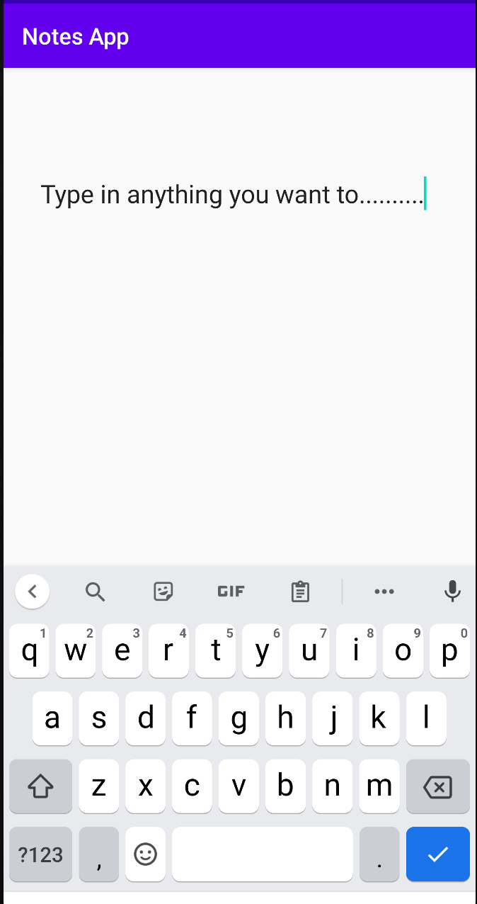
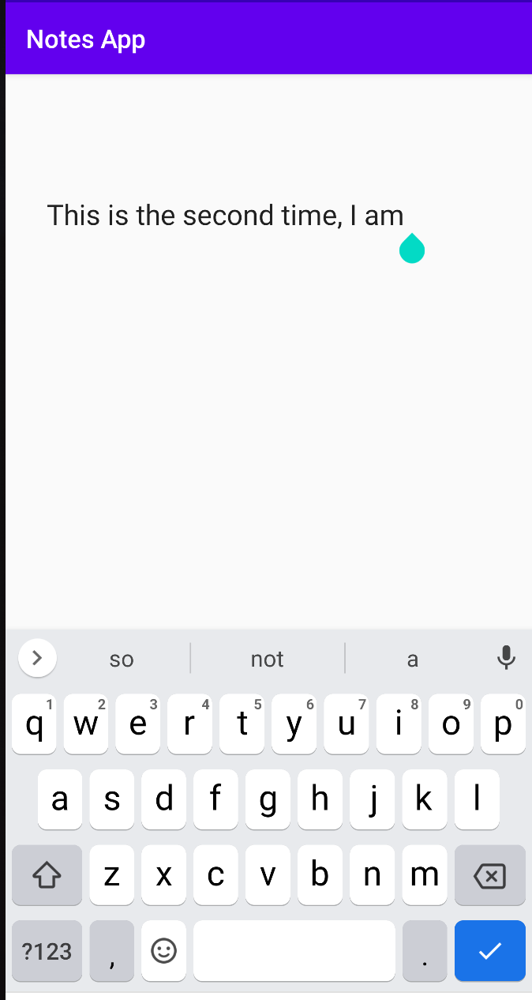
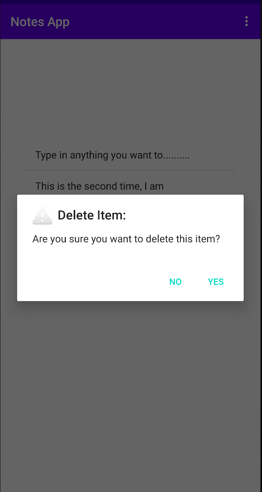

# Notes-Making-Application
An android application that enables the user to take notes.

## Default Screen (Landing Page)

## Adding a New Note

## Note Added Successfully

## Adding Another Note

## New Note Added to the Existing List

## Deleting an Already Existing Note

## 

